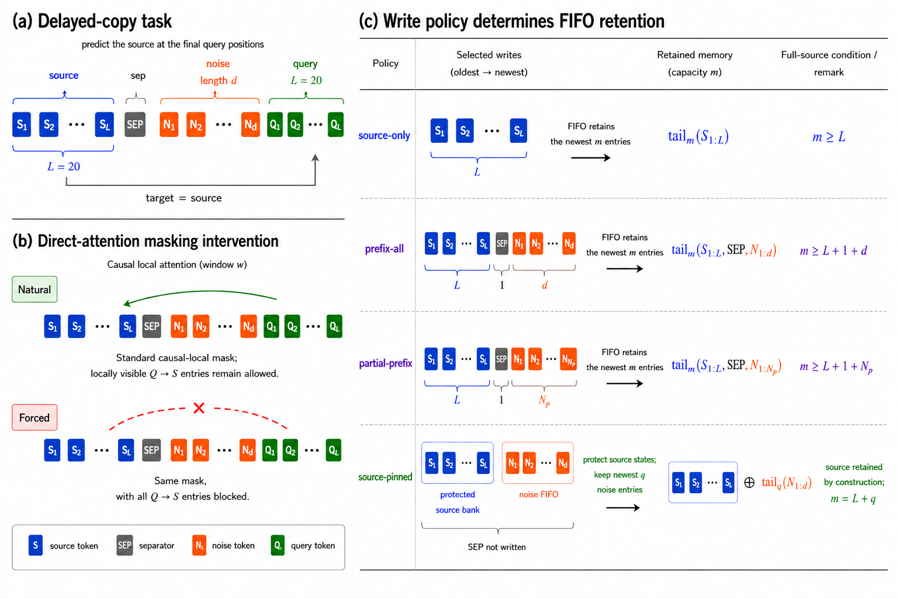

# Write Policy Determines Source Retention in External FIFO Memory: A Delayed-Copy Diagnostic

This repository contains the code, frozen result tables, and figures for **“Write Policy Determines Source Retention in External FIFO Memory: A Delayed-Copy Diagnostic,” accepted to the Findings of EMNLP 2026**.

## Scope

The project is a controlled synthetic diagnostic of how write policy changes source retention and the observed capacity boundary of a finite external FIFO hidden-state memory. Experiments A–C use delayed copying, and Experiment D tests the same retention effect with symbolic key–value records.

The models use learned absolute positional embeddings, selected final-encoder hidden states as memory keys and values, and one post-encoder content-based read. The study does not evaluate pretrained decoder-only language models, downstream long-context tasks, or layer-wise autoregressive KV caches.

## Diagnostic overview

Figure 1 is a manually authored schematic of the task, masking intervention, and write policies. It is not generated by the experimental plotting scripts and contains no empirical results.

## Repository structure

~~~text
WritePolicyFIFO/
├── DelayedCopyTask/          # Data generators, models, memory, training, utilities
├── Schematic/
│   └── fig1_task_mask_writepolicy.png  # Manually authored Figure 1
├── run_expA.py               # Delayed-copy capacity-boundary experiment
├── run_expB.py               # Retention, attention, and error diagnostics
├── run_expC.py               # Intermediate write-policy experiment
├── run_expD.py               # Symbolic key–value experiment
├── plot_expA.py ... plot_expD.py
├── Results/
│   ├── expA/                 # 1 frozen raw CSV + 3 derived CSVs
│   ├── expB/                 # 1 frozen raw CSV + 2 derived CSVs
│   ├── expC/                 # 1 frozen raw CSV + 3 derived CSVs
│   └── expD/                 # 1 frozen raw CSV + 2 derived CSVs
├── Figures/
│   ├── expA/                 # 17 PNGs
│   ├── expB/                 # 12 PNGs
│   ├── expC/                 # 2 PNGs
│   └── expD/                 # 2 PNGs
├── tests/                    # 20 lightweight regression tests
├── requirements.txt
└── LICENSE
~~~

All commands below are intended to be run from the repository root. Relative input and output paths are resolved from that root.

## Environment

The reference environment used for the recorded experiments was:

- WSL2
- Python 3.9.25
- PyTorch 2.8.0 with CUDA 12.8
- NumPy 2.0.1
- pandas 2.3.3
- Matplotlib 3.9.2

Create and activate an environment, for example:

~~~bash
conda create -n write-policy-fifo python=3.9.25
conda activate write-policy-fifo
python -m pip install --upgrade pip
~~~

For the reference CUDA 12.8 build, install the matching PyTorch wheel first:

~~~bash
python -m pip install torch==2.8.0 --index-url https://download.pytorch.org/whl/cu128
python -m pip install -r requirements.txt
~~~

The requirements file also pins `torch==2.8.0`; after the CUDA wheel is installed, the second command retains that installed build while checking the version constraint. For a CPU-only or different CUDA platform, install the appropriate PyTorch 2.8.0 build for that platform before installing the remaining pinned requirements.

## Experiments

| Experiment | Diagnostic | Formal conditions | Training |
| --- | --- | --- | --- |
| A | Delayed-copy capacity boundaries under source-only, prefix-all, and source-pinned writing | delays 10/20/40/80; naive and gated memory readouts; forced window 8, plus a natural-mask sanity control | 3,001 steps × seeds 0–6 |
| B | Source survival, post-training accuracy, memory attention, and error types | delays 40/80; three write policies; naive and gated readouts; forced window 8; 16 post-training evaluation batches | 3,001 steps × seeds 0–6 |
| C | Intermediate writing with a controlled fraction of non-source states | delays 20/40/80; write ratios 0/.25/.5/.75/1; naive and gated readouts; forced window 8 | 3,001 steps × seeds 0–6 |
| D | Symbolic key–value retrieval beyond direct delayed copying | delays 20/40/80; three write policies; naive and gated readouts; forced window 8 | 9,001 steps × seeds 0–6 |

The controlled write policies are:

- **source-only:** write only the source states; this is an oracle-like retention control;
- **prefix-all:** write the complete pre-query prefix, so later states can evict the source under FIFO;
- **source-pinned:** protect all source states in a dedicated bank, admit noise states to a separate FIFO of capacity `q`, and do not write the separator;
- **intermediate (Experiment C):** always write source and separator states, then admit `round(p × delay)` noise states.

Experiment D uses records of the form `[FACT][KEY][IS][VALUE...]`. Distractors use non-target keys. The query supplies the target key but not its value, and the target is the complete source record.

## Fixed paper protocol

- Every optimization step generates a fresh synthetic minibatch; there is no fixed training dataset.
- Seeds are 0–6.
- Experiments A–C use 3,001 optimization steps; Experiment D uses 9,001.
- The training-tail window is the final 500 steps.
- The operational threshold is `tau = 0.95`.
- Memory is reset for every minibatch and does not leak state across optimization steps.

### `acc_mean_tail`

At each optimization step, token accuracy is averaged over all target positions and examples in that fresh minibatch. `acc_mean_tail` is the arithmetic mean of those step-level accuracies over the final 500 training steps. It is an end-of-training operational metric, not accuracy on a fixed held-out dataset.

### Experiment B `eval_acc`

After training, Experiment B switches the model to evaluation mode and averages query-token accuracy over 16 independent fresh evaluation minibatches generated from a separate deterministic random stream. This post-training diagnostic is distinct from `acc_mean_tail`, which summarizes the final 500 training minibatches.

### Aggregate and seed-wise capacity boundaries

For an aggregate boundary, `acc_mean_tail` is first averaged across the seven seeds at each capacity. The boundary is the smallest scanned capacity whose seed-averaged accuracy reaches `tau`. It is **not** the mean of seven seed-wise boundaries.

A seed-wise boundary is computed separately for each seed. If no scanned capacity reaches `tau`, the boundary is right-censored: the finite boundary is stored as `NaN`, and the scan maximum is retained separately. Means, sample standard deviations, and ranges of seed-wise boundaries use only observed finite boundaries; censoring counts are reported explicitly.

## Tests

The regression suite covers delayed-copy and symbolic-KV data protocols, local and forced attention masks, FIFO write policies, training-tail metrics, aggregate boundaries, and right-censoring.

~~~bash
python -m unittest discover -s tests -v
~~~

The suite contains 20 tests and does not start model training.

## Plot the frozen paper results

The formal raw CSVs and formal figures already exist. The plotting scripts refuse to overwrite existing outputs unless `--overwrite` is supplied. The commands below write to an ignored isolation directory instead:

~~~bash
python plot_expA.py \
  --csv Results/expA/results_expA_paper.csv \
  --figure-dir tmp/replot/Figures/expA \
  --derived-dir tmp/replot/Results/expA

python plot_expB.py \
  --csv Results/expB/results_expB_paper.csv \
  --figure-dir tmp/replot/Figures/expB \
  --derived-dir tmp/replot/Results/expB

python plot_expC.py \
  --csv Results/expC/results_expC_paper.csv \
  --figure-dir tmp/replot/Figures/expC \
  --derived-dir tmp/replot/Results/expC

python plot_expD.py \
  --csv Results/expD/results_expD_paper.csv \
  --figure-dir tmp/replot/Figures/expD \
  --derived-dir tmp/replot/Results/expD
~~~

Reusing the same isolation directory will trigger overwrite protection. Choose another directory or add `--overwrite` only when replacement is intentional.

## Smoke runs

Smoke mode uses one seed and two optimization steps per configuration. It verifies the training path but does not reproduce paper results.

~~~bash
python run_expA.py --mode smoke --device cpu
python run_expB.py --mode smoke --device cpu
python run_expC.py --mode smoke --device cpu
python run_expD.py --mode smoke --device cpu
~~~

The default smoke outputs are written under `tmp/smoke/expA` through `tmp/smoke/expD`. A repeated run will refuse to replace an existing smoke CSV unless `--overwrite` is explicitly supplied.

## Full paper-protocol training

Full training is computationally expensive: across all configurations, the four runners execute approximately 20 million optimization steps. The following commands preserve the frozen paper CSVs by writing reruns under the ignored `tmp/reproduction` directory:

~~~bash
python run_expA.py \
  --mode paper \
  --device cuda:0 \
  --output tmp/reproduction/expA/results_expA_paper.csv

python run_expB.py \
  --mode paper \
  --device cuda:0 \
  --output tmp/reproduction/expB/results_expB_paper.csv

python run_expC.py \
  --mode paper \
  --device cuda:0 \
  --output tmp/reproduction/expC/results_expC_paper.csv

python run_expD.py \
  --mode paper \
  --device cuda:0 \
  --output tmp/reproduction/expD/results_expD_paper.csv
~~~

Use `--device auto`, `--device cpu`, or another indexed CUDA device when appropriate. The scripts validate the formal protocol before training and refuse to replace an existing output by default. Experiment B writes a temporary checkpoint CSV during a paper run; it removes the checkpoint after successful completion but does not automatically resume an interrupted run.

## Results files

| Experiment | Frozen raw results | Derived tables |
| --- | --- | --- |
| A | [results_expA_paper.csv](Results/expA/results_expA_paper.csv) | [mstar_forced_window8_tau0.95.csv](Results/expA/mstar_forced_window8_tau0.95.csv), [boundary_tau_sensitivity_window8.csv](Results/expA/boundary_tau_sensitivity_window8.csv), [boundary_seed_stability_window8_tau0.95.csv](Results/expA/boundary_seed_stability_window8_tau0.95.csv) |
| B | [results_expB_paper.csv](Results/expB/results_expB_paper.csv) | [expB_aggregated_summary.csv](Results/expB/expB_aggregated_summary.csv), [expB_multiseed_stats.csv](Results/expB/expB_multiseed_stats.csv) |
| C | [results_expC_paper.csv](Results/expC/results_expC_paper.csv) | [expC_mean_accuracy_by_capacity.csv](Results/expC/expC_mean_accuracy_by_capacity.csv), [expC_boundary_summary.csv](Results/expC/expC_boundary_summary.csv), [expC_per_seed_boundary_summary.csv](Results/expC/expC_per_seed_boundary_summary.csv) |
| D | [results_expD_paper.csv](Results/expD/results_expD_paper.csv) | [expD_boundary_summary.csv](Results/expD/expD_boundary_summary.csv), [expD_per_seed_boundary_summary.csv](Results/expD/expD_per_seed_boundary_summary.csv) |

The frozen raw tables contain 2,072, 476, 1,848, and 756 rows for Experiments A–D, respectively. The ten derived tables can be regenerated from those four raw CSVs without retraining.

## Figures

The repository contains 34 PNGs: one manually authored schematic and 33 experimental plots. The manuscript uses 12 of them: Figure 1, five experimental plots in the main text, and six experimental plots in the appendix. The remaining 22 experimental plots are retained as additional diagnostics for auditability and exploratory comparison.

Legend:

- **Main:** cited in the main paper;
- **Appendix:** cited in the paper appendix;
- **Additional:** retained in the repository but not cited by the current manuscript.

- **Main (Figure 1)** — [fig1_task_mask_writepolicy.png](Schematic/fig1_task_mask_writepolicy.png) — manually authored diagnostic schematic.

Experiment A — 17 PNGs

- Additional — [expA_forced_prefix-all_window8_heatmap.png](Figures/expA/expA_forced_prefix-all_window8_heatmap.png)
- Additional — [expA_forced_source-only_window8_heatmap.png](Figures/expA/expA_forced_source-only_window8_heatmap.png)
- Additional — [expA_forced_source-pinned-noise-fifo_window8_heatmap.png](Figures/expA/expA_forced_source-pinned-noise-fifo_window8_heatmap.png)
- **Main** — [expA_mstar_forced_gated_window8_tau0.95.png](Figures/expA/expA_mstar_forced_gated_window8_tau0.95.png)
- **Appendix** — [expA_mstar_forced_naive_window8_tau0.95.png](Figures/expA/expA_mstar_forced_naive_window8_tau0.95.png)
- Additional — [expA_mstar_tau_overlay_window8.png](Figures/expA/expA_mstar_tau_overlay_window8.png)
- Additional — [expA_natural_sanity_delay80_mem20_writesource-only.png](Figures/expA/expA_natural_sanity_delay80_mem20_writesource-only.png)
- Additional — [expA_policy_curves_modelgated_delay10_window8.png](Figures/expA/expA_policy_curves_modelgated_delay10_window8.png)
- Additional — [expA_policy_curves_modelgated_delay20_window8.png](Figures/expA/expA_policy_curves_modelgated_delay20_window8.png)
- Additional — [expA_policy_curves_modelgated_delay40_window8.png](Figures/expA/expA_policy_curves_modelgated_delay40_window8.png)
- Additional — [expA_policy_curves_modelgated_delay80_window8.png](Figures/expA/expA_policy_curves_modelgated_delay80_window8.png)
- Additional — [expA_policy_curves_modelnaive_delay10_window8.png](Figures/expA/expA_policy_curves_modelnaive_delay10_window8.png)
- Additional — [expA_policy_curves_modelnaive_delay20_window8.png](Figures/expA/expA_policy_curves_modelnaive_delay20_window8.png)
- Additional — [expA_policy_curves_modelnaive_delay40_window8.png](Figures/expA/expA_policy_curves_modelnaive_delay40_window8.png)
- Additional — [expA_policy_curves_modelnaive_delay80_window8.png](Figures/expA/expA_policy_curves_modelnaive_delay80_window8.png)
- Additional — [expA_source_pinned_noise_budget_gated_window8.png](Figures/expA/expA_source_pinned_noise_budget_gated_window8.png)
- Additional — [expA_source_pinned_noise_budget_naive_window8.png](Figures/expA/expA_source_pinned_noise_budget_naive_window8.png)

Experiment B — 12 PNGs

- **Appendix** — [expB_error_type_rates_gated.png](Figures/expB/expB_error_type_rates_gated.png)
- **Appendix** — [expB_error_type_rates_naive.png](Figures/expB/expB_error_type_rates_naive.png)
- Additional — [expB_eval_accuracy_gated.png](Figures/expB/expB_eval_accuracy_gated.png)
- Additional — [expB_eval_accuracy_naive.png](Figures/expB/expB_eval_accuracy_naive.png)
- **Main** — [expB_prefix_all_attention_mass_gated.png](Figures/expB/expB_prefix_all_attention_mass_gated.png)
- Additional — [expB_prefix_all_attention_mass_naive.png](Figures/expB/expB_prefix_all_attention_mass_naive.png)
- **Appendix** — [expB_source_pinned_attention_mass_gated.png](Figures/expB/expB_source_pinned_attention_mass_gated.png)
- Additional — [expB_source_pinned_attention_mass_naive.png](Figures/expB/expB_source_pinned_attention_mass_naive.png)
- Additional — [expB_source_survival_gated.png](Figures/expB/expB_source_survival_gated.png)
- Additional — [expB_source_survival_naive.png](Figures/expB/expB_source_survival_naive.png)
- **Main** — [expB_survival_vs_accuracy_gated.png](Figures/expB/expB_survival_vs_accuracy_gated.png)
- Additional — [expB_survival_vs_accuracy_naive.png](Figures/expB/expB_survival_vs_accuracy_naive.png)

Experiment C — 2 PNGs

- **Main** — [expC_intermediate_boundary_gated.png](Figures/expC/expC_intermediate_boundary_gated.png)
- **Appendix** — [expC_intermediate_boundary_naive.png](Figures/expC/expC_intermediate_boundary_naive.png)

Experiment D — 2 PNGs

- **Main** — [expD_symbolic_boundary_gated.png](Figures/expD/expD_symbolic_boundary_gated.png)
- **Appendix** — [expD_symbolic_boundary_naive.png](Figures/expD/expD_symbolic_boundary_naive.png)

The additional figures include policy heatmaps, per-delay policy curves, threshold sensitivity, a natural-mask sanity check, source-pinned noise-budget curves, standalone retention/accuracy diagnostics, and naive-versus-gated comparisons. They are useful for inspection but are not additional claims beyond the frozen paper analysis.

## Reproducibility notes

- Synthetic batches are generated online; no external dataset download is required.
- The four frozen raw CSVs are the evidence used for the paper. The ten derived tables and 33 experimental plots are deterministic functions of those CSVs. Figure 1 is a manually authored schematic and contains no empirical results.
- Re-running training with the same seeds is intended to reproduce the protocol, but CUDA kernels, hardware, drivers, and library builds can introduce small numerical differences.
- Capacity boundaries depend on the explicitly scanned grids. A right-censored result states only that the threshold was not reached within that grid.
- The release contains CSV results and figures, not trained model checkpoints.
- The scope is a controlled diagnostic; results should not be read as direct downstream long-context or pretrained-LLM evidence.

## License

The code is released under the [MIT License](LICENSE). Copyright © 2026 Xiangyang Liu.

## Citation

The archival ACL Anthology BibTeX record is not yet available during camera-ready preparation. Please cite the final Findings of EMNLP 2026 proceedings entry once it is published, using the exact archival author list, pages, and identifier.

Current bibliographic identity:

- **Title:** Write Policy Determines Source Retention in External FIFO Memory: A Delayed-Copy Diagnostic
- **Venue:** Findings of the Association for Computational Linguistics: EMNLP 2026
- **Year:** 2026

This section deliberately does not guess unpublished page numbers, DOI, or final proceedings metadata.
